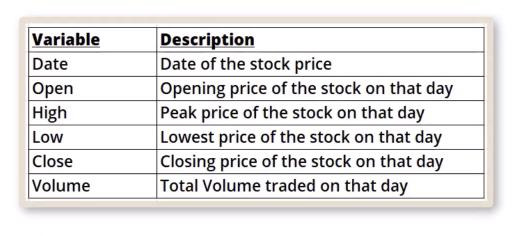

# QUIZ on Advanced Statistics With Python .............

- QUESTION: Find the possible futuristic price movement of the stock "GOOG", based on its price for the past five years. The analysis must be based on the adjusted closing price of the stock. Use Yahoo yfinance package for the analysis to generate the following and plot the graph with the actual price.

1. the 50-day moving average (50 DMA)
2. the 200-day moving average (200 DMA)

Use the following libraries:

- yfinance - to get stock historical data
- Ticker Symbol "GOOG" - to help perform analysis
  Generate the report on the jupyterLab Notebook using text and code, and plot. Submit the report.

# SOLUTION.................

Problem Statement:

- A stock price always fluctuates, but there is a relation between its closing prices and its moving averages?

- A analyst wants to showcase how the stock would move, he has 5-years of stock price data with him on which he needs to perform the analysis.

# Objective

- Find the possible futuristic movement of the stock "GOOG" based on its price for the last 5 years.

* Here is how we will describe the data
  

  - Perform the following steps:\*

  1. Get 5 years of data from Finance Package with Ticker Symbol "GOOG"
  2. Create the 50DMA and 200DMA
  3. Plot it with the Actual Price
  4. Get Basic EDA on the Data
  5. Fit Statsmodel OLS to find the best possible features and its statistical scores.
  6. Give final predictions and comments on how this has been achieved.
